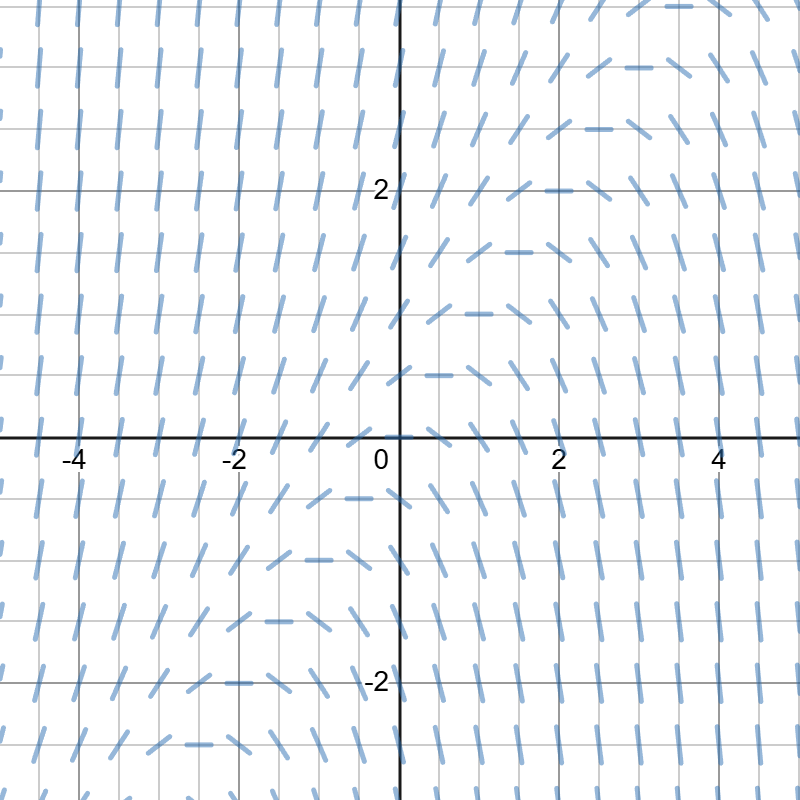
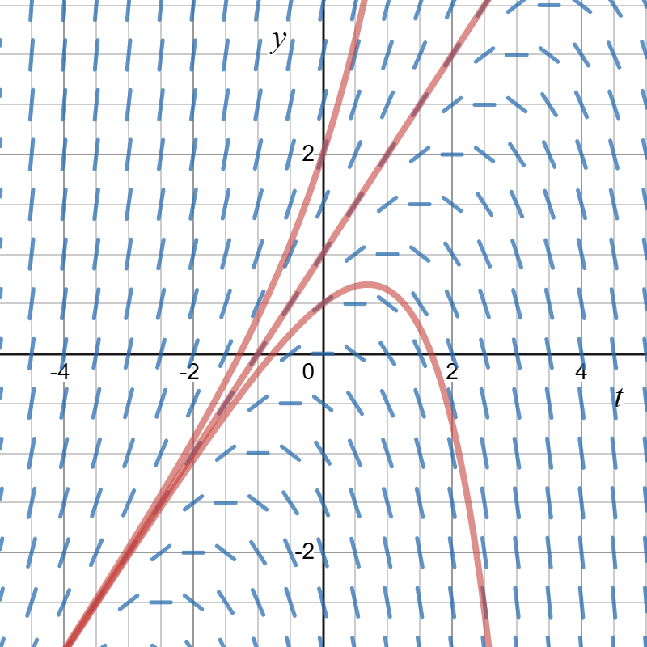
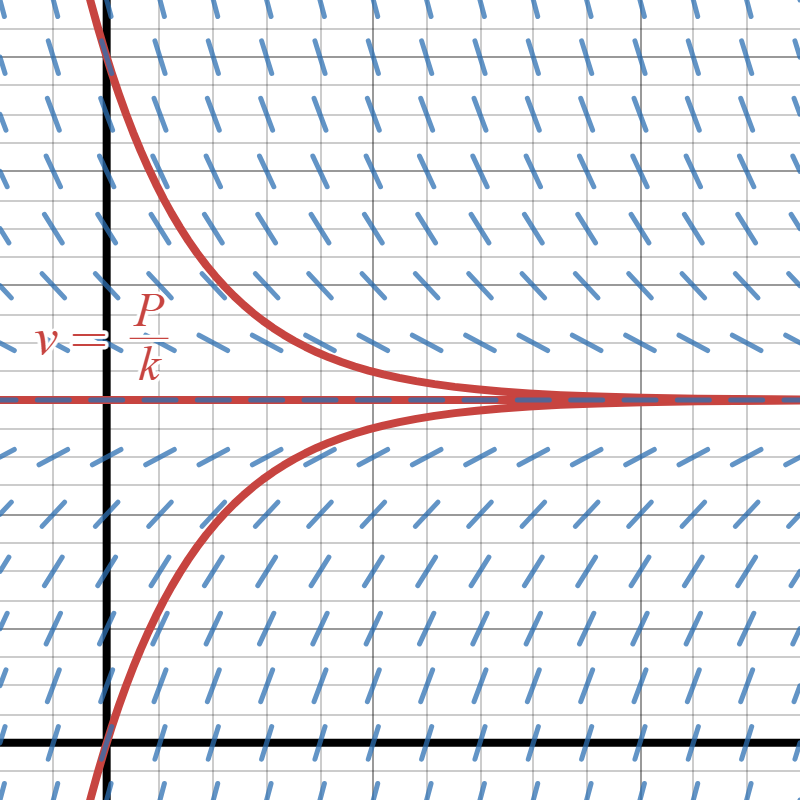
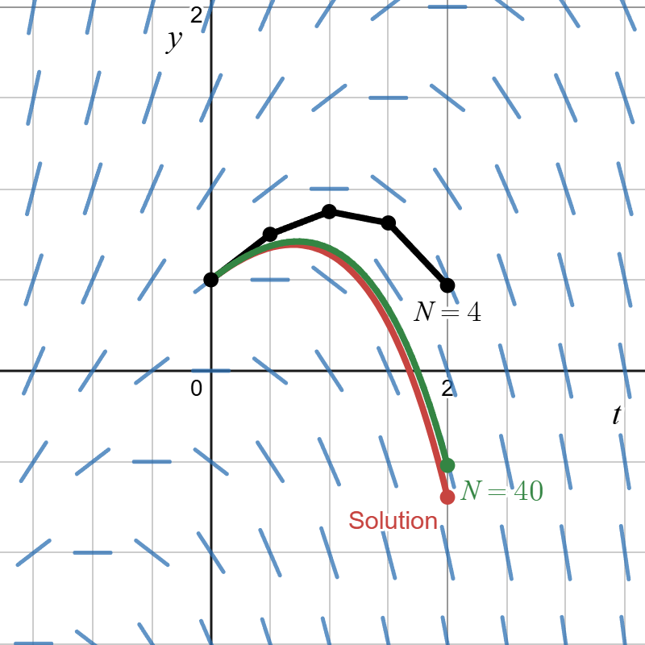

---
title: 'Analyze & Interpret the Model'
subtitle: Read Sections 1.2-4
sidebar: notes
--- 
Once we have converted our question into a clearly stated, well-defined math problem, we can begin to analyze it.

## Step 2: Analyze the Model
Just like in calculus, we use a three-pronged approach to analyze differential equations:

- **Qualitative Approach.** What does the equation governing the slope of the model tell us about the properties of any solution? Can we sketch a graph of the solution? Can we determine the long-run behavior of a solution? How do the properties of a solution depend on the parameters in the model?
- **Numerical Approach.** Is there a numerical method we can use to estimate the values of a solution? Can we determine error bounds for this method? How does the error or convergence of the method depend on initial values or parameters?   
- **Analytical Approach.** Do we know a solution exists? Given some initial state, is the solution unique? Is it possible to actually extract a formula for the model?

## Qualitative Approach - Slope Fields
Slope fields are one tool that we can use to try and understand the behavior of a solution $y(t)$. To create a slope field for the equation $\frac{dy}{dt}=f(t,y)$:

- Select a grid of points in the $(t,y)$-plane.
- At each point $(t,y)$ in your grid, draw a small line through that point with slope $f(t,y)$.
- Each "slope" that you draw really represents a tangent line. Any solution passing through that point must be tangent to the line you draw at that point.
- Once all your slopes are drawn, sit back and stare at it for a bit like a Magic Eye puzzle.

If $f(t,y)$ isn't too complicated, we can use the slope field to, either mentally or by hand, sketch out what a solution to the differential equation is going to look like. At the very least, try to *see* where a solution $y(t)$ will be increasing/decreasing. You may also be able to see what happens to $y(t)$ as $t\to\infty$. Occasionally, you may even be able to guess formulas for simple solutions to the differential equation based on the slope field. (See below for an example of such a scenario.) 

:::{.callout-note collapse="true" icon=false}
### Example - Slope Field
For example, the slope field for $\frac{dy}{dt}=y-t$ is shown below:

{#fig-slopefield-ex width=40%}

Looking closely at the slope field, we can see that there is one particular line where all the slopes line up. This suggests that any solution starting on this line will stay on this line. The equation of that line is $y=t+1$. 

Is this actually a solution? Checking $y(t)=t+1$: 
$$\begin{align}
& y'(t)=1 \\
& y(t)-t = t+1 - t = 1   
\end{align}$$
We see that this satisfies the differential equation and is therefore a solution. 

We can also see how other solutions will behave relative to the one we found. If a solution starts above the line $y=t+1$, it will increase away from this line. If a solution starts just below $y=t+1$, it will increase at first, but its slope will be less than 1 and so it will bend away from the line $y=t+1$. Eventually, the solution will intersect the line $y=t$, where all the values of $dy/dt=0$; after this point, the solution will decrease.  

{#fig-slopefield-ex width=40%}

:::

### Discussion Problem 1: Sprint Speed Continued

Recall that our model for a sprinter's speed throughout a 100m race is given by: $$m\frac{dv}{dt}=mP-kmv$$
where $m$ is the sprinter's mass (in kg), $P$ represents the max effort acceleration a sprinter can achieve (in m/s$^2$), and $k$ is the proportionality constant for the resistive force (in s$^{-1}$). 

We will start by analyzing it qualitatively: 

a. Describe how the sprinter's speed is expected to change throughout the race according to the model. Will it increase? decrease?
b. Describe how the sprinter's acceleration is expected to change throughout the race.
c. Sketch a graph of $v(t)$. What do you expect to happen to $v(t)$ in the long run, i.e. what is $$\lim_{t\to\infty}v(t)?$$ What is the practical significance of this?

:::{.callout-tip collapse="true" icon=false}
### Answer:
First, it helps to simplify the differential equation by dividing through by mass: $$\frac{dv}{dt}=P-kv$$

a. Note that $\frac{dv}{dt}=0$ when $v=\frac{P}{k}$. So, that means if the sprinter is ever going at this speed, they will stay at this speed for all time. A constant solution to a differential equation, like this one, is called a *equilibrium solution*.  

    If $v>\frac{P}{k}$, then $\frac{dv}{dt}<0$, and so at this speed, their speed will decrease.

    If $v<\frac{P}{k}$, then $\frac{dv}{dt}>0$, and so at this speed, their speed will increase.

    In context, their speed at the beginning of the race will be 0 and so this is telling us that their speed should *increase* throughout the race according to the model.

b. If $v$ is increasing throughout the race, then their acceleration $$\frac{dv}{dt}=P-kv$$ will *decrease*.

c. [Here is a "sketch" of a solution using a *slope* or *direction field*.](https://www.geogebra.org/calculator/av9pd2xr)

{#fig-sprint-ex width=40%}

What this tells us is that as the race goes on, the runner's speed will approach a threshold of $P/k$. This tells us that, if a runner is looking to improve their performance, they need to figure out how to make $P$ bigger or $k$ smaller.   
:::

## Numerical Approach - Euler's Method

When sketching solutions using a slope field, we start at a particular point, then move forward by allowing the slopes to "push" the solution in a particular direction. *Euler's method* makes this idea a little more precise by turning it in to a sequence of computations. 

The main idea---to approximate a solution $y(t)$ for the differential equation 
$$\frac{dy}{dt}=f(t,y):$$

- Choose $(t_0, y_0)$, the starting point in the $(t,y)$-plane. If you are solving an initial value problem, use the indicated starting point. 
- Specify an ending time $t_N>t_0$. 
- Choose $N$, the total number of steps you will be using to get from $t_0$ to $t_N$.
- Use linear approximation to recursively generate a sequence of estimates $y_1, y_2, \ldots, y_N$ for the values $y(t_1), y(t_2), \ldots, y(t_N)$.
- The piecewise linear function defined by the points $(t_0, y_0), (t_1,y_1), \ldots, (t_N,y_N)$ is then your approximation for the solution $y(t)$ on the interval $t_0\leq t\leq t_N$.

:::{.callout-note collapse="true" icon=false}
### Example - Euler's Method
For example, we can apply this idea to approximate the solution of $$\frac{dy}{dt}=y-t$$ on the interval $0\leq t \leq 2$, assuming that $y(0)=0.5$. Using four steps ($N=4$):

|Step $k$ | $t_k$ | $y_k$ | $dy/dt\bigr\rvert_{(t_k,y_k)}$ |
|---|---|---|---|
| 0| $0$ | $0.5$ |$0.5-0=0.5$  |
| 1 | $0.5$ |$0.5+0.5\cdot 0.5 = 0.75$ | $0.75-0.5=0.25$ |
|2 | $1$  | $0.75+0.25\cdot0.5 = 0.875$ | $0.875-1= -0.125$|
|3 | $1.5$| $0.875 - 0.125\cdot0.5 = 0.8125$ | $0.8125-1.5 = -0.6875$ |
|4 | $2$ | $0.8125-0.6875\cdot 0.5 = 0.46875$ | $0.46875 - 2 = -1.53125$|

: Euler's Method, $N=4$ {tbl-colwidths="[10,10,40,40]"}

The graph below shows how the approximate solution (black) compares to the actual solution (red). The green curve illustrates the improvement in the approximate solution when we increase the number of steps used by a factor of 10.

{#fig-euler-ex width=40%}

:::

### Discussion Problem 2: Sprint Speed Continued.
Next, can we use our equation to make numerical estimates for how the value of $v(t)$ will change throughout the race. Let's assume that $P=10$ $m\cdot s^{-2}$ and $k=0.85$ s$^{-1}$ for a particular sprinter during a race. Assume that their speed, $v$, is $0$ $m\cdot s^{-1}$ initially at $t=0$ and that for $t\geq 0$, their speed changes according to our model.

Use the information provided to determine/estimate the following values of $v(t)$ and $v'(t)$:

| $t$ (s) | 0 | 2 | 4 | 6 | 8 | 10 |
|---|---|---|---|---|---|---|
| $v'(t)$ (ms$^{-2}$) | | | | | | |
| $v(t)$ (ms$^{-1}$) | 0 | | | | | |

### Discussion Problem 3: Analytical Analysis.
This particular model is an example of a *separable* equation. These types of equations can be solved using a technique called *separation of variables*. 

a. After we discuss the idea, try and use this technique to solve the equation. 
b. Once you have your general solution, try and solve the *initial value problem*, where we are looking for a solution to the equation such that $v(0)=0$.

## Step 3: Interpret the Model

The results of your mathematical analysis ultimately have to be reframed in the context of your model. What did you learn? How does it relate to your motivating questions? Do your assumptions place any limitations on what you can reasonably take away from your analysis? 

If possible, compare how well your model fits real data. What can you learn from any discrepancies and how can you use this information to make your model better?  

## Example: Sprint Speed Conclusion

### Discussion Problem 4: Check your model against real data.

In this case, we are modeling a relationship between real-world variables and so we can check how well our model performs against real data. In the 2024 Summer Olympics, [Julien Alfred](https://www.youtube.com/watch?v=-HiJu8huJ9I&t=18s) (St. Lucia) and [Noah Lyles](https://www.youtube.com/watch?v=7Xnr805bm4E) (USA) won the women's and men's 100m races. Data from each of their final 100m races is included in the table below:

| $x$ (m) | 0 | 10 | 20 | 30 | 40 | 50 | 60 | 70 | 80 | 90 | 100 |
|---|---|---|---|---|---|---|---|---|---|---|---|
| Alfred $t$ (s) | 0.14 | 1.96 | 3.07 | 4.07 | 5.03 | 5.96 | 6.89 | 7.84 | 8.78 | 9.73 | 10.72 |
| Lyles $t$ (s) | 0.18 | 1.95 | 2.98 | 3.90 | 4.76 | 5.61 | 6.44 | 7.26 | 8.09 | 8.93 | 9.79 |

: Official results for the [women's 100m final](https://olympics.com/OG2024/pdf/OG2024/ATH/OG2024_ATH_C77A_ATHW100M--------------FNL-000100--.pdf) and [men's 100m final](https://olympics.com/OG2024/pdf/OG2024/ATH/OG2024_ATH_C77A_ATHM100M--------------FNL-000100--.pdf).

a. Note that each one did not immediately start running. The first recorded time is their *reaction time* $t_0$. How can this be factored into our model?
b. The data from the race compares distance vs. time. Using your answer to Problem 3b, find a formula for the distance a sprinter had run, $x(t)$ (in m), $t$ seconds into the race for $t>t_0$.
c. Alfred's reaction time was $0.14$s and Lyles' was $0.18$s. Their race data has been loaded into Desmos [here](https://www.desmos.com/calculator/zt025mreaf). Using your general formula for $x(t)$ and the curve fitting tool in Desmos, determine the values of $P$ and $k$ that best fit the data.